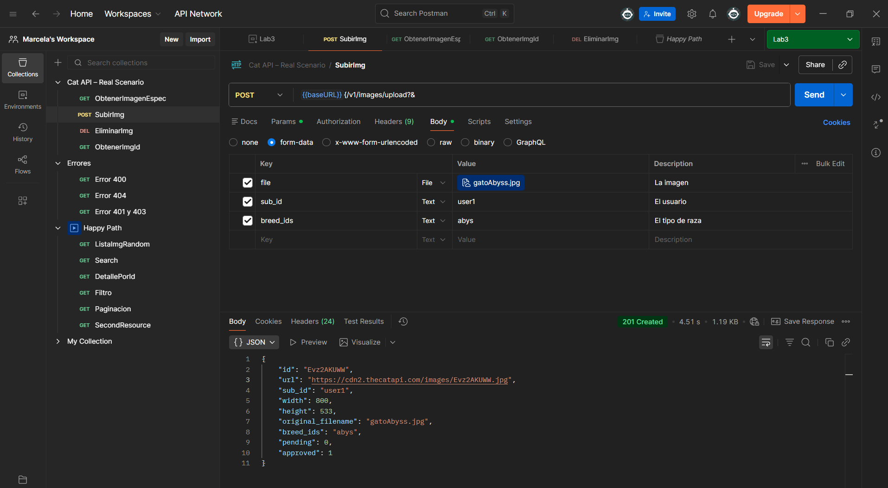
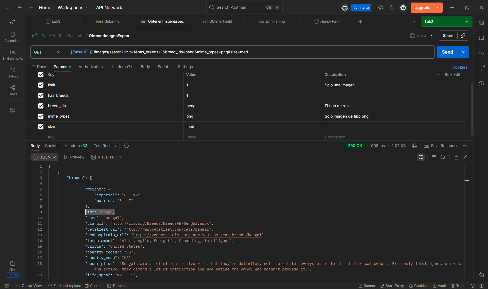
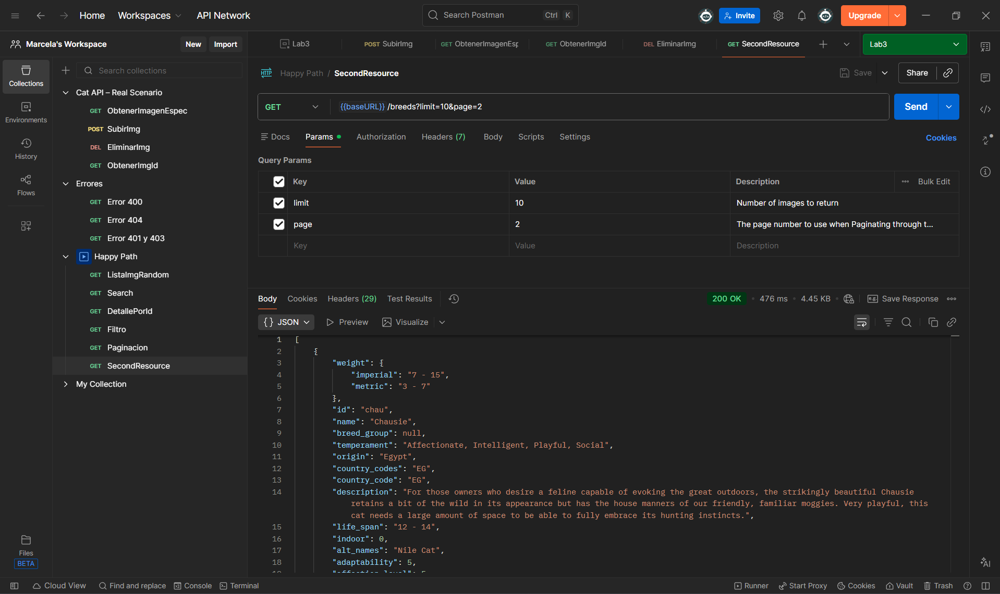
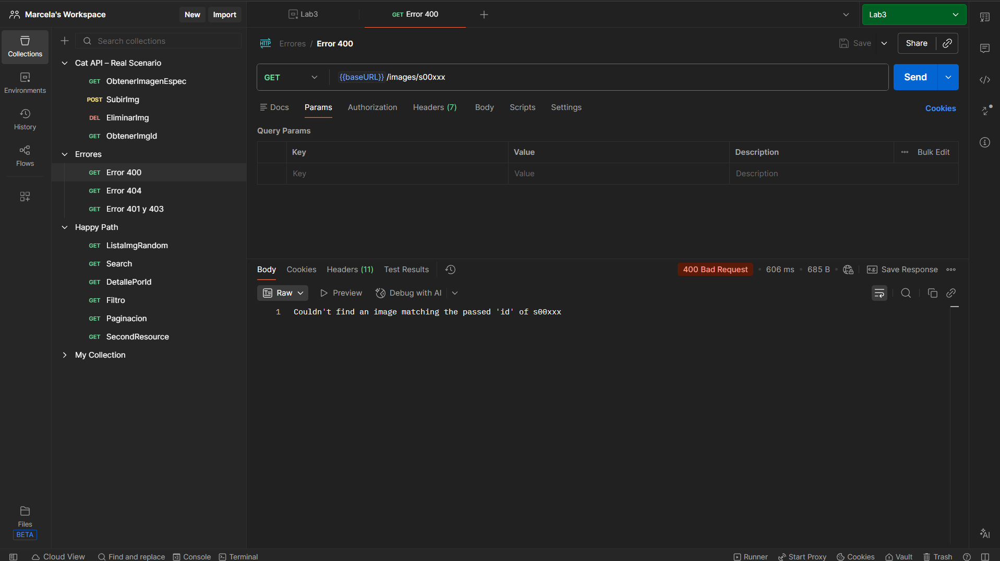
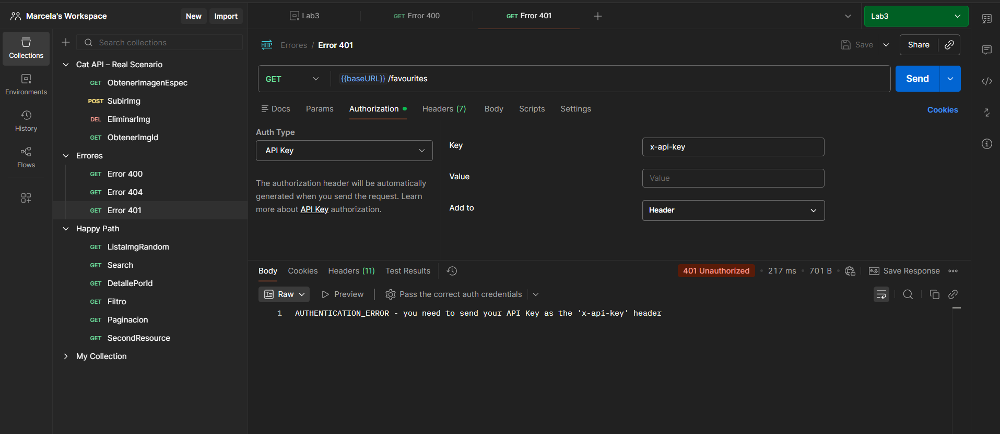

# Informe de Onboarding de API

## Resumen de la API

- **Nombre de la API:** TheCatAPI  
- **Base URL:** https://api.thecatapi.com/v1 
- **Tipo de autenticación:** API Key mediante header `x-api-key` 
- **Rate limit:**
   - Sin API Key:
      - Máximo 10 imágenes por request
      - Acceso limitado a imágenes
  - Con API Key:
    - Hasta 100 imágenes por request
    - Acceso completo a endpoints
    - Permite upload y delete de imágenes
- **Links de la documentación:** 
  - **General:** https://developers.thecatapi.com/view-account/ylX4blBYT9FaoVd6OhvR?report=FJkYOq9tW 
  - **Para usar en Postman** https://documenter.getpostman.com/view/5578104/RWgqUxxh#8606c7c6-338e-46aa-8f1a-3335ed2b8127
---

# Environment utilizado

| Variable | Valor |
|---------|------|
| baseURL | https://api.thecatapi.com/v1 |
| resource | images/search |
| id | 1 |
| query | limit=10 |
| apiKey | API_KEY |

---

# Endpoints (resumen)

## Colección 1 – Happy Path

| Método | URL | Query Params | Headers | Status Esperado | Status Obtenido |
|-------|-----|-------------|---------|-----------------|----------------|
GET | {{baseURL}}/images/search | limit=10 | x-api-key | 200 OK | 200 OK |
GET | {{baseURL}}/images/0XYvRd7oD | - | x-api-key | 200 OK | 200 OK |
GET | {{baseURL}}/images/search| has_breeds=0 limit=5 order=DESC | x-api-key | 200 OK | 200 OK |
GET | {{baseURL}}/images/search | limit=5 has_breeds=1 breed_ids=beng order=RANDOM mime_types=jpg | x-api-key | 200 OK | 200 OK |
GET | {{baseURL}}/images/search | order=ASC limit=2 page=2| none | 200 OK | 200 OK |
GET | {{baseURL}}/breeds | limit=10 page=2 | none | 200 OK | 200 OK |

---

## Colección 2 – Errores Intencionales

| Método | URL | Query Params | Headers | Status Esperado | Status Obtenido |
|-------|-----|-------------|---------|-----------------|----------------|
GET | {{baseURL}}/images/s00xxx| - | x-api-key | 400 Bad Request| 400 Bad Request |
GET | {{baseURL}}/favorite | - | x-api-key | 404 Not Found | 404 Not Found |
GET | {{baseURL}}/favourites| - | x-api-key vacía | 401 Unauthorized | 401 Unauthorized |
GET | {{baseURL}}/favourites| - | x-api-key inválida | 403 Forbidden | 401 Unauthorized |

---

# Colección 3 – Solicitudes Reales

| Método | URL | Query Params | Headers | Status Esperado | Status Obtenido |
|-------|-----|-------------|---------|-----------------|----------------|
GET |{{baseURL}}/images/search| limit=1 has_breeds=1 breed_ids=beng mime_types=png size=med| x-api-key | 200 OK | 200 OK |
POST | {{baseURL}}/v1/images/upload | file, sub_id, breed_ids | x-api-key | 201 Created | 201 Created |
GET |{{baseURL}}/images/{image_id}|- | x-api-key | 200 OK | 200 OK |
DELETE | {{baseURL}}/images/{image_id} | - | x-api-key | 200 OK | 204 No Content |

# Evidencia de respuestas (capturas)

## ÉXITOS
-Éxito con el método POST para subir una imagen 

-Éxito con el método GET

-Éxito con el método GET

## FALLIDAS
-Error 400

-Error 401

---

## Observaciones

- Algunos endpoints GET funcionan sin API Key pero con limitaciones
- Los endpoints POST y DELETE requieren autenticación obligatoria
- Los errores HTTP fueron reproducidos intencionalmente para pruebas
- La API devuelve respuestas en formato JSON