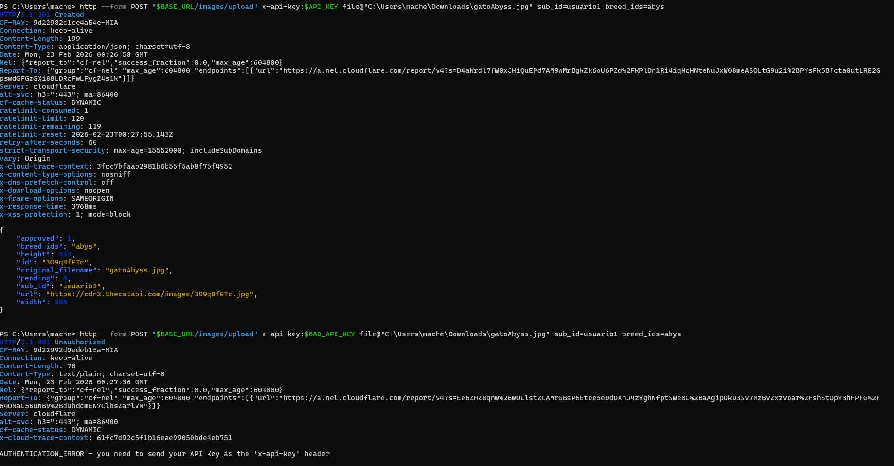

# HTTPie Commands – TheCatAPI

Este archivo contiene comandos HTTPie equivalentes a los requests realizados en Postman usando TheCatAPI.

Se utilizan variables de entorno, headers y ejemplos de autenticación correcta y fallida.

---

## Variables de entorno

```powershell
BASE_URL=https://api.thecatapi.com/v1
RESOURCE=images
ID="0XYvRd7oD"
API_KEY=API_KEY
BAD_API_KEY=12345
LIMIT=10

##Listar recurso principal
##Autenticacion correcta
http GET "$BASE_URL/images/search" x-api-key:$API_KEY limit==$LIMIT


##Detalle por ID
http GET "$BASE_URL/images/$ID" x-api-key:$API_KEY


##Búsqueda
http GET "$BASE_URL/images/search" x-api-key:$API_KEY has_breeds==0 limit==5 order==DESC

##Filtro
http GET "$BASE_URL/images/search" x-api-key:$API_KEY limit==5 has_breeds==1 breed_ids==beng order==RANDOM mime_types==jpg

##Paginación
http GET "$BASE_URL/breeds" order==ASC limit==2 page==2


##Segundo recurso
http GET "$BASE_URL/breeds" limit==10 page==2


##Error 404
http GET "$BASE_URL/favoriye" x-api-key:$API_KEY

##Error 400
http GET "$BASE_URL/images/s00xxx" x-api-key:$API_KEY

##Autenticación fallida
#Se necesita usar form por que HTTPie por defecto envía un JSON y la API necesita un multipart/form-data
http --form POST "$BASE_URL/images/upload" x-api-key:$BAD_API_KEY file@"C:\Users\mache\Downloads\gatoAbyss.jpg" sub_id=usuario1 breed_ids=abys


##Subir imagen POST
http --form POST "$BASE_URL/images/upload" x-api-key:$API_KEY file@"C:\Users\mache\Downloads\gatoAbyss.jpg" sub_id=usuario1 breed_ids=abys

```

Comprobación de auth
